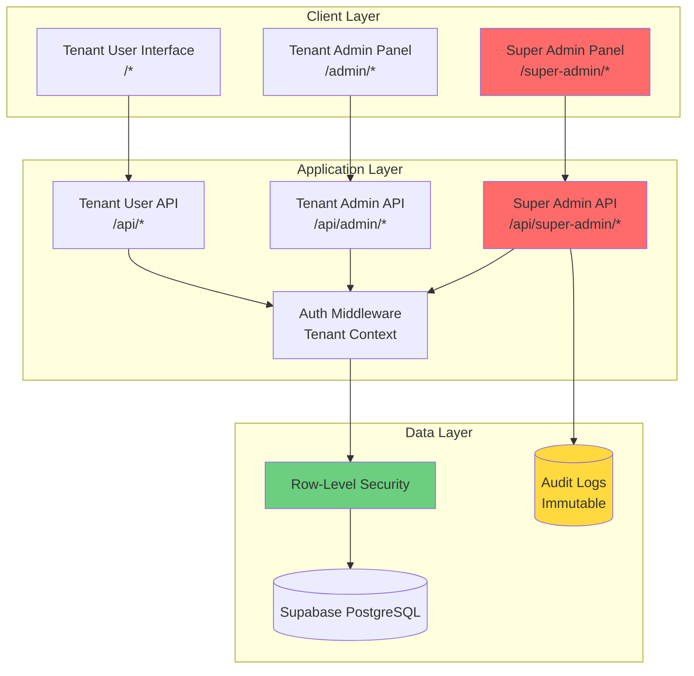
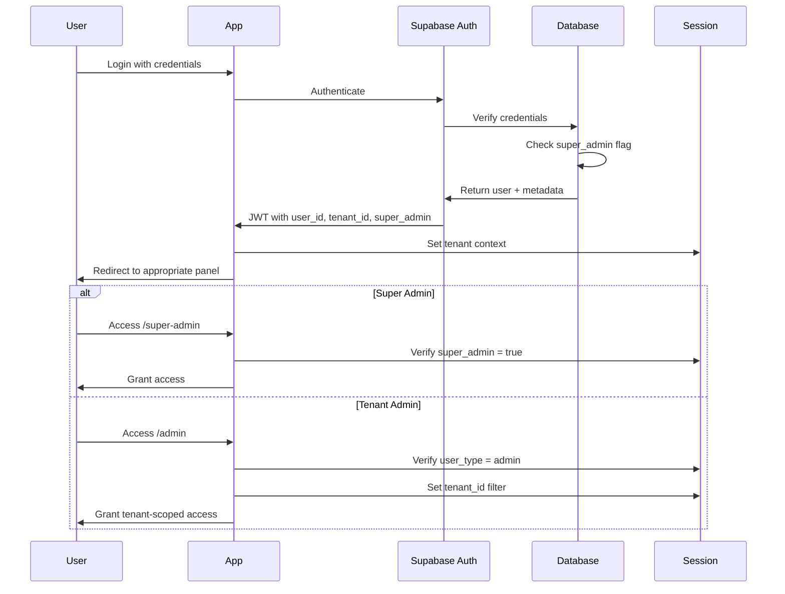
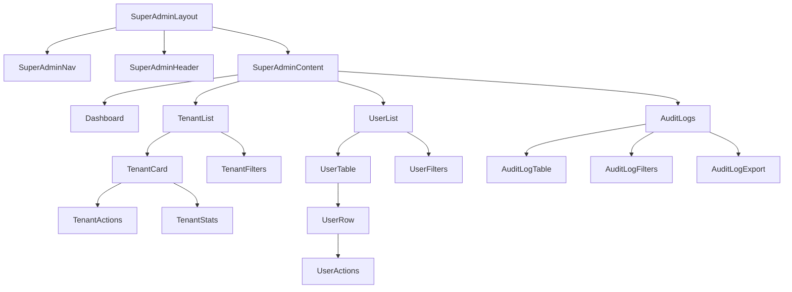
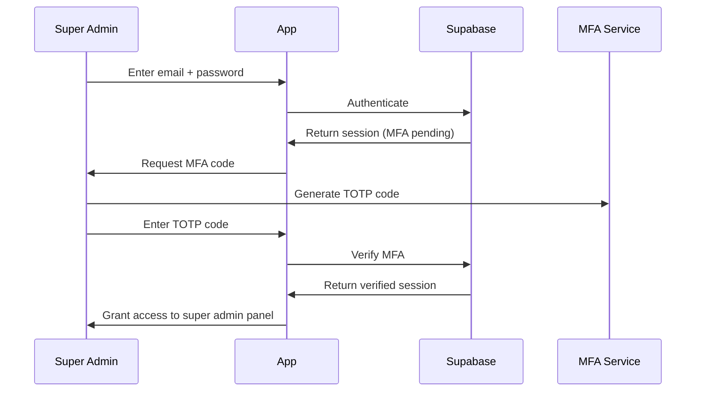

# Design Document: Super Admin System

## Overview

The Super Admin System introduces multi-tenant capabilities to the LegalMY platform, enabling centralized management of multiple isolated client instances. This design implements a hierarchical administrative structure where super administrators have system-wide access while maintaining strict tenant data isolation for security and compliance.

### Key Design Goals

1. **Multi-Tenancy**: Support multiple isolated client instances with shared infrastructure
2. **Security**: Implement defense-in-depth with MFA, audit logging, and role-based access control
3. **Data Isolation**: Guarantee tenant data cannot be accessed by other tenants through row-level security
4. **Scalability**: Support 100+ tenants with minimal performance impact
5. **Backward Compatibility**: Preserve existing admin panel functionality while adding super admin capabilities
6. **Compliance**: Meet SOC 2, GDPR, and PDPA audit requirements

### Architecture Principles

- **Separation of Concerns**: Super admin panel is completely separate from tenant admin panels
- **Least Privilege**: Users and admins can only access data within their tenant scope
- **Audit Everything**: All privileged operations are logged immutably
- **Fail Secure**: Default to denying access when tenant context is ambiguous
- **Progressive Enhancement**: Existing single-tenant functionality continues to work during migration

## Architecture

### System Architecture Diagram



### Multi-Tenant Architecture

The system implements multi-tenancy using a **shared database, shared schema** approach with row-level security (RLS) for data isolation:

- **Tenant Identification**: Each tenant has a unique `tenant_id` (UUID)
- **Data Isolation**: RLS policies filter all queries by `tenant_id` from session context
- **Super Admin Bypass**: Super admins can set `app.bypass_rls = true` for cross-tenant operations
- **Session Context**: Tenant context is established during authentication and persists in the session

### Authentication Flow



## Components and Interfaces

### Database Schema Components

#### 1. Tenants Table

Stores tenant configuration and metadata.

```sql
CREATE TABLE public.tenants (
  id UUID DEFAULT uuid_generate_v4() PRIMARY KEY,
  name TEXT NOT NULL,
  subdomain TEXT UNIQUE NOT NULL,
  primary_domain TEXT UNIQUE,
  status TEXT DEFAULT 'active' CHECK (status IN ('active', 'inactive', 'suspended')),
  subscription_plan TEXT DEFAULT 'free' CHECK (subscription_plan IN ('free', 'basic', 'premium', 'enterprise')),
  subscription_start_date TIMESTAMP WITH TIME ZONE,
  subscription_end_date TIMESTAMP WITH TIME ZONE,
  created_at TIMESTAMP WITH TIME ZONE DEFAULT NOW(),
  updated_at TIMESTAMP WITH TIME ZONE DEFAULT NOW(),
  created_by UUID REFERENCES auth.users(id),
  user_count INTEGER DEFAULT 0,
  metadata JSONB DEFAULT '{}'::jsonb
);

CREATE INDEX idx_tenants_subdomain ON public.tenants(subdomain);
CREATE INDEX idx_tenants_status ON public.tenants(status);
CREATE INDEX idx_tenants_subscription_plan ON public.tenants(subscription_plan);
```

#### 2. Tenant Settings Table

Stores OEM configuration per tenant.

```sql
CREATE TABLE public.tenant_settings (
  id UUID DEFAULT uuid_generate_v4() PRIMARY KEY,
  tenant_id UUID REFERENCES public.tenants(id) ON DELETE CASCADE NOT NULL,
  setting_key TEXT NOT NULL,
  setting_value JSONB NOT NULL,
  created_at TIMESTAMP WITH TIME ZONE DEFAULT NOW(),
  updated_at TIMESTAMP WITH TIME ZONE DEFAULT NOW(),
  UNIQUE(tenant_id, setting_key)
);

CREATE INDEX idx_tenant_settings_tenant ON public.tenant_settings(tenant_id);
CREATE INDEX idx_tenant_settings_key ON public.tenant_settings(setting_key);
```

**OEM Configuration Schema** (stored in `setting_value` JSONB):

```typescript
interface OEMConfiguration {
  branding: {
    siteName: string;
    logo: string;
    favicon: string;
    primaryColor: string;
    secondaryColor: string;
    accentColor: string;
  };
  features: {
    ecommerce: boolean;
    templates: boolean;
    articles: boolean;
    consultations: boolean;
    reviews: boolean;
  };
  languages: {
    default: 'en' | 'zh' | 'ms';
    enabled: Array<'en' | 'zh' | 'ms'>;
  };
  business: {
    currency: string;
    timezone: string;
    consultationPricing: {
      min: number;
      max: number;
    };
  };
  email: {
    fromName: string;
    fromEmail: string;
    replyTo: string;
  };
}
```

#### 3. Audit Logs Table

Immutable log of all super admin actions.

```sql
CREATE TABLE public.audit_logs (
  id UUID DEFAULT uuid_generate_v4() PRIMARY KEY,
  super_admin_id UUID REFERENCES auth.users(id) NOT NULL,
  action_type TEXT NOT NULL,
  target_entity TEXT NOT NULL,
  target_id UUID,
  changes JSONB,
  ip_address INET,
  user_agent TEXT,
  session_id TEXT,
  created_at TIMESTAMP WITH TIME ZONE DEFAULT NOW()
);

-- Prevent updates and deletes
CREATE POLICY "Audit logs are immutable"
  ON public.audit_logs FOR UPDATE
  USING (false);

CREATE POLICY "Audit logs cannot be deleted"
  ON public.audit_logs FOR DELETE
  USING (false);

CREATE INDEX idx_audit_logs_super_admin ON public.audit_logs(super_admin_id);
CREATE INDEX idx_audit_logs_action_type ON public.audit_logs(action_type);
CREATE INDEX idx_audit_logs_target ON public.audit_logs(target_entity, target_id);
CREATE INDEX idx_audit_logs_created_at ON public.audit_logs(created_at DESC);
```

**Action Types**:
- `tenant.create`, `tenant.update`, `tenant.delete`, `tenant.activate`, `tenant.deactivate`
- `user.create`, `user.update`, `user.delete`, `user.migrate`, `user.impersonate`
- `admin.create`, `admin.update`, `admin.revoke`
- `password.reset`, `password.force_change`
- `settings.update`, `settings.delete`
- `backup.create`, `backup.restore`
- `api_key.create`, `api_key.revoke`

#### 4. System Settings Table

Global configuration that applies across all tenants.

```sql
CREATE TABLE public.system_settings (
  id UUID DEFAULT uuid_generate_v4() PRIMARY KEY,
  setting_key TEXT UNIQUE NOT NULL,
  setting_value JSONB NOT NULL,
  description TEXT,
  created_at TIMESTAMP WITH TIME ZONE DEFAULT NOW(),
  updated_at TIMESTAMP WITH TIME ZONE DEFAULT NOW()
);

CREATE INDEX idx_system_settings_key ON public.system_settings(setting_key);
```

**System Setting Keys**:
- `maintenance_mode`: `{ enabled: boolean, message: string }`
- `feature_flags`: `{ [key: string]: boolean }`
- `api_rate_limits`: `{ default: number, premium: number }`
- `default_oem_config`: OEMConfiguration
- `email_templates`: `{ [template_name: string]: string }`
- `backup_schedule`: `{ frequency: string, retention_days: number }`
- `security_settings`: `{ mfa_required: boolean, session_timeout: number }`

#### 5. Modified Profiles Table

Add tenant_id and super_admin columns.

```sql
-- Add new columns to existing profiles table
ALTER TABLE public.profiles 
  ADD COLUMN IF NOT EXISTS tenant_id UUID REFERENCES public.tenants(id) ON DELETE CASCADE,
  ADD COLUMN IF NOT EXISTS super_admin BOOLEAN DEFAULT false;

-- Create indexes
CREATE INDEX idx_profiles_tenant ON public.profiles(tenant_id);
CREATE INDEX idx_profiles_super_admin ON public.profiles(super_admin) WHERE super_admin = true;

-- Update RLS policies
DROP POLICY IF EXISTS "Public profiles are viewable by everyone" ON public.profiles;
DROP POLICY IF EXISTS "Users can update their own profile" ON public.profiles;

-- New RLS policies with tenant scoping
CREATE POLICY "Users can view profiles in their tenant"
  ON public.profiles FOR SELECT
  USING (
    tenant_id = current_setting('app.current_tenant_id', true)::uuid
    OR current_setting('app.bypass_rls', true)::boolean = true
  );

CREATE POLICY "Users can update their own profile"
  ON public.profiles FOR UPDATE
  USING (
    auth.uid() = id
    AND (tenant_id = current_setting('app.current_tenant_id', true)::uuid
         OR current_setting('app.bypass_rls', true)::boolean = true)
  );

CREATE POLICY "Super admins can insert profiles"
  ON public.profiles FOR INSERT
  WITH CHECK (
    current_setting('app.bypass_rls', true)::boolean = true
    OR auth.uid() = id
  );
```

#### 6. Modified Multi-Tenant Tables

Add tenant_id to all tables that store tenant-specific data:

```sql
-- Add tenant_id to existing tables
ALTER TABLE public.lawyers ADD COLUMN IF NOT EXISTS tenant_id UUID REFERENCES public.tenants(id) ON DELETE CASCADE;
ALTER TABLE public.consultations ADD COLUMN IF NOT EXISTS tenant_id UUID REFERENCES public.tenants(id) ON DELETE CASCADE;
ALTER TABLE public.orders ADD COLUMN IF NOT EXISTS tenant_id UUID REFERENCES public.tenants(id) ON DELETE CASCADE;
ALTER TABLE public.reviews ADD COLUMN IF NOT EXISTS tenant_id UUID REFERENCES public.tenants(id) ON DELETE CASCADE;
ALTER TABLE public.templates ADD COLUMN IF NOT EXISTS tenant_id UUID REFERENCES public.tenants(id) ON DELETE CASCADE;
ALTER TABLE public.articles ADD COLUMN IF NOT EXISTS tenant_id UUID REFERENCES public.tenants(id) ON DELETE CASCADE;
ALTER TABLE public.favorites ADD COLUMN IF NOT EXISTS tenant_id UUID REFERENCES public.tenants(id) ON DELETE CASCADE;
ALTER TABLE public.cart ADD COLUMN IF NOT EXISTS tenant_id UUID REFERENCES public.tenants(id) ON DELETE CASCADE;
ALTER TABLE public.services ADD COLUMN IF NOT EXISTS tenant_id UUID REFERENCES public.tenants(id) ON DELETE CASCADE;

-- Create indexes for performance
CREATE INDEX idx_lawyers_tenant ON public.lawyers(tenant_id);
CREATE INDEX idx_consultations_tenant ON public.consultations(tenant_id);
CREATE INDEX idx_orders_tenant ON public.orders(tenant_id);
CREATE INDEX idx_reviews_tenant ON public.reviews(tenant_id);
CREATE INDEX idx_templates_tenant ON public.templates(tenant_id);
CREATE INDEX idx_articles_tenant ON public.articles(tenant_id);
CREATE INDEX idx_favorites_tenant ON public.favorites(tenant_id);
CREATE INDEX idx_cart_tenant ON public.cart(tenant_id);
CREATE INDEX idx_services_tenant ON public.services(tenant_id);
```

#### 7. Row-Level Security Policies

Apply tenant-scoped RLS policies to all multi-tenant tables:

```sql
-- Example for lawyers table (repeat pattern for all tables)
DROP POLICY IF EXISTS "Lawyers are viewable by everyone" ON public.lawyers;

CREATE POLICY "Lawyers are viewable within tenant"
  ON public.lawyers FOR SELECT
  USING (
    tenant_id = current_setting('app.current_tenant_id', true)::uuid
    OR current_setting('app.bypass_rls', true)::boolean = true
  );

CREATE POLICY "Lawyers can update their profile within tenant"
  ON public.lawyers FOR UPDATE
  USING (
    auth.uid() = user_id
    AND (tenant_id = current_setting('app.current_tenant_id', true)::uuid
         OR current_setting('app.bypass_rls', true)::boolean = true)
  );

CREATE POLICY "Admins can insert lawyers within tenant"
  ON public.lawyers FOR INSERT
  WITH CHECK (
    tenant_id = current_setting('app.current_tenant_id', true)::uuid
    OR current_setting('app.bypass_rls', true)::boolean = true
  );
```

#### 8. Password Reset Tokens Table

```sql
CREATE TABLE public.password_reset_tokens (
  id UUID DEFAULT uuid_generate_v4() PRIMARY KEY,
  user_id UUID REFERENCES auth.users(id) ON DELETE CASCADE NOT NULL,
  token TEXT UNIQUE NOT NULL,
  expires_at TIMESTAMP WITH TIME ZONE NOT NULL,
  used_at TIMESTAMP WITH TIME ZONE,
  created_by UUID REFERENCES auth.users(id),
  created_at TIMESTAMP WITH TIME ZONE DEFAULT NOW()
);

CREATE INDEX idx_password_reset_tokens_token ON public.password_reset_tokens(token);
CREATE INDEX idx_password_reset_tokens_user ON public.password_reset_tokens(user_id);
CREATE INDEX idx_password_reset_tokens_expires ON public.password_reset_tokens(expires_at);
```

### API Components

#### Super Admin API Routes

All super admin API routes are prefixed with `/api/super-admin` and require super admin authentication.

**Authentication Middleware**:

```typescript
// src/middleware/superAdminAuth.ts
import { createClient } from '@/lib/supabase/server';
import { NextResponse } from 'next/server';

export async function requireSuperAdmin(request: Request) {
  const supabase = await createClient();
  
  const { data: { user }, error } = await supabase.auth.getUser();
  
  if (error || !user) {
    return NextResponse.json({ error: 'Unauthorized' }, { status: 401 });
  }
  
  // Check super_admin flag
  const { data: profile } = await supabase
    .from('profiles')
    .select('super_admin')
    .eq('id', user.id)
    .single();
  
  if (!profile?.super_admin) {
    return NextResponse.json({ error: 'Forbidden: Super admin access required' }, { status: 403 });
  }
  
  // Enable RLS bypass for super admin
  await supabase.rpc('set_config', {
    setting: 'app.bypass_rls',
    value: 'true'
  });
  
  return { user, supabase };
}
```

#### 1. Tenant Management API

**POST /api/super-admin/tenants**
- Create a new tenant
- Request body: `{ name, subdomain, primary_domain, subscription_plan, oem_config }`
- Response: `{ tenant_id, admin_account }`

**GET /api/super-admin/tenants**
- List all tenants with pagination
- Query params: `page`, `limit`, `status`, `search`
- Response: `{ tenants: [], total, page, limit }`

**GET /api/super-admin/tenants/:id**
- Get tenant details
- Response: `{ tenant, settings, stats }`

**PATCH /api/super-admin/tenants/:id**
- Update tenant configuration
- Request body: `{ name?, subdomain?, status?, subscription_plan? }`
- Response: `{ tenant }`

**DELETE /api/super-admin/tenants/:id**
- Delete tenant (with confirmation)
- Response: `{ success, archived_data_id }`

**POST /api/super-admin/tenants/:id/activate**
- Activate a tenant
- Response: `{ tenant }`

**POST /api/super-admin/tenants/:id/deactivate**
- Deactivate a tenant
- Response: `{ tenant }`

#### 2. OEM Configuration API

**GET /api/super-admin/tenants/:id/settings**
- Get all settings for a tenant
- Response: `{ settings: { [key: string]: any } }`

**PUT /api/super-admin/tenants/:id/settings/:key**
- Update a specific setting
- Request body: `{ value: any }`
- Response: `{ setting }`

**POST /api/super-admin/tenants/:id/settings/bulk**
- Bulk update settings
- Request body: `{ settings: { [key: string]: any } }`
- Response: `{ updated_count }`

#### 3. User Management API

**GET /api/super-admin/users**
- List all users across tenants
- Query params: `page`, `limit`, `tenant_id`, `user_type`, `search`
- Response: `{ users: [], total, page, limit }`

**GET /api/super-admin/users/:id**
- Get user details
- Response: `{ user, tenant, activity }`

**PATCH /api/super-admin/users/:id**
- Update user details
- Request body: `{ user_type?, tenant_id?, full_name?, phone? }`
- Response: `{ user }`

**POST /api/super-admin/users/:id/migrate**
- Migrate user to different tenant
- Request body: `{ target_tenant_id }`
- Response: `{ user, migrated_data_count }`

**POST /api/super-admin/users/:id/impersonate**
- Start impersonation session
- Response: `{ impersonation_token, expires_at }`

**POST /api/super-admin/users/:id/deactivate**
- Deactivate user account
- Response: `{ user }`

#### 4. Admin Management API

**POST /api/super-admin/admins**
- Create tenant admin account
- Request body: `{ email, full_name, tenant_id }`
- Response: `{ admin, activation_link }`

**GET /api/super-admin/admins**
- List all tenant admins
- Query params: `tenant_id`, `page`, `limit`
- Response: `{ admins: [], total }`

**PATCH /api/super-admin/admins/:id/reassign**
- Reassign admin to different tenant
- Request body: `{ tenant_id }`
- Response: `{ admin }`

**DELETE /api/super-admin/admins/:id**
- Revoke admin privileges
- Response: `{ success }`

#### 5. Password Reset API

**POST /api/super-admin/password-reset**
- Initiate password reset for any user
- Request body: `{ user_id }`
- Response: `{ reset_token, reset_link, expires_at }`

**GET /api/super-admin/password-reset/history**
- View password reset history
- Query params: `user_id`, `page`, `limit`
- Response: `{ resets: [], total }`

**POST /api/reset-password** (public endpoint)
- Complete password reset with token
- Request body: `{ token, new_password }`
- Response: `{ success }`

#### 6. Audit Log API

**GET /api/super-admin/audit-logs**
- Query audit logs
- Query params: `page`, `limit`, `action_type`, `target_entity`, `super_admin_id`, `start_date`, `end_date`
- Response: `{ logs: [], total, page, limit }`

**GET /api/super-admin/audit-logs/export**
- Export audit logs
- Query params: `format` (csv|json), `start_date`, `end_date`
- Response: File download

#### 7. System Settings API

**GET /api/super-admin/system-settings**
- Get all system settings
- Response: `{ settings: { [key: string]: any } }`

**PUT /api/super-admin/system-settings/:key**
- Update system setting
- Request body: `{ value: any }`
- Response: `{ setting }`

**POST /api/super-admin/system-settings/maintenance-mode**
- Toggle maintenance mode
- Request body: `{ enabled: boolean, message?: string }`
- Response: `{ maintenance_mode }`

#### 8. Analytics API

**GET /api/super-admin/analytics/tenants/:id**
- Get tenant analytics
- Query params: `start_date`, `end_date`, `metrics`
- Response: `{ metrics: { user_count, consultation_count, revenue, active_lawyers }, trends: [] }`

**GET /api/super-admin/analytics/compare**
- Compare metrics across tenants
- Query params: `tenant_ids`, `metric`, `start_date`, `end_date`
- Response: `{ comparison: [] }`

**POST /api/super-admin/analytics/export**
- Export analytics report
- Request body: `{ tenant_id?, format, metrics, start_date, end_date }`
- Response: File download

### Frontend Components

#### Super Admin Panel Structure

```
src/app/super-admin/
├── layout.tsx                 # Super admin layout with navigation
├── page.tsx                   # Dashboard
├── login/
│   └── page.tsx              # Super admin login with MFA
├── tenants/
│   ├── page.tsx              # Tenant list
│   ├── [id]/
│   │   ├── page.tsx          # Tenant details
│   │   ├── settings/
│   │   │   └── page.tsx      # OEM configuration
│   │   ├── users/
│   │   │   └── page.tsx      # Tenant users
│   │   └── analytics/
│   │       └── page.tsx      # Tenant analytics
│   └── new/
│       └── page.tsx          # Create tenant wizard
├── users/
│   ├── page.tsx              # Cross-tenant user list
│   └── [id]/
│       └── page.tsx          # User details
├── admins/
│   ├── page.tsx              # Tenant admin list
│   └── new/
│       └── page.tsx          # Create tenant admin
├── audit-logs/
│   └── page.tsx              # Audit log viewer
├── settings/
│   └── page.tsx              # System settings
└── components/
    ├── TenantCard.tsx
    ├── UserTable.tsx
    ├── AuditLogTable.tsx
    ├── AnalyticsChart.tsx
    ├── OEMConfigForm.tsx
    └── TenantWizard.tsx
```

#### Component Hierarchy



#### State Management

The super admin panel uses React Context for state management with the following contexts:

**SuperAdminContext**:
```typescript
interface SuperAdminContextType {
  user: SuperAdminUser | null;
  loading: boolean;
  tenants: Tenant[];
  selectedTenant: Tenant | null;
  setSelectedTenant: (tenant: Tenant | null) => void;
  refreshTenants: () => Promise<void>;
  bypassRLS: boolean;
  setBypassRLS: (bypass: boolean) => void;
}
```

**AuditLogContext**:
```typescript
interface AuditLogContextType {
  logs: AuditLog[];
  filters: AuditLogFilters;
  setFilters: (filters: AuditLogFilters) => void;
  exportLogs: (format: 'csv' | 'json') => Promise<void>;
  refreshLogs: () => Promise<void>;
}
```

**TenantContext** (for tenant-scoped operations):
```typescript
interface TenantContextType {
  currentTenant: Tenant | null;
  settings: OEMConfiguration | null;
  updateSettings: (key: string, value: any) => Promise<void>;
  users: User[];
  analytics: TenantAnalytics | null;
  refreshData: () => Promise<void>;
}
```

#### Routing and Access Control

**Route Protection**:

```typescript
// src/middleware/superAdminRoute.ts
export function withSuperAdminAuth(Component: React.ComponentType) {
  return function SuperAdminRoute(props: any) {
    const { user, loading } = useSuperAdmin();
    const router = useRouter();
    
    useEffect(() => {
      if (!loading && (!user || !user.super_admin)) {
        router.push('/super-admin/login');
      }
    }, [user, loading, router]);
    
    if (loading) {
      return <LoadingSpinner />;
    }
    
    if (!user || !user.super_admin) {
      return null;
    }
    
    return <Component {...props} />;
  };
}
```

**Navigation Structure**:

```typescript
const superAdminNavItems = [
  {
    label: 'Dashboard',
    href: '/super-admin',
    icon: LayoutDashboard,
  },
  {
    label: 'Tenants',
    href: '/super-admin/tenants',
    icon: Building,
  },
  {
    label: 'Users',
    href: '/super-admin/users',
    icon: Users,
  },
  {
    label: 'Admins',
    href: '/super-admin/admins',
    icon: Shield,
  },
  {
    label: 'Audit Logs',
    href: '/super-admin/audit-logs',
    icon: FileText,
  },
  {
    label: 'System Settings',
    href: '/super-admin/settings',
    icon: Settings,
  },
];
```

## Data Models

### TypeScript Interfaces

```typescript
// Tenant
interface Tenant {
  id: string;
  name: string;
  subdomain: string;
  primary_domain: string | null;
  status: 'active' | 'inactive' | 'suspended';
  subscription_plan: 'free' | 'basic' | 'premium' | 'enterprise';
  subscription_start_date: string | null;
  subscription_end_date: string | null;
  created_at: string;
  updated_at: string;
  created_by: string;
  user_count: number;
  metadata: Record<string, any>;
}

// Tenant Settings
interface TenantSetting {
  id: string;
  tenant_id: string;
  setting_key: string;
  setting_value: any;
  created_at: string;
  updated_at: string;
}

// OEM Configuration (stored in tenant_settings)
interface OEMConfiguration {
  branding: {
    siteName: string;
    logo: string;
    favicon: string;
    primaryColor: string;
    secondaryColor: string;
    accentColor: string;
  };
  features: {
    ecommerce: boolean;
    templates: boolean;
    articles: boolean;
    consultations: boolean;
    reviews: boolean;
  };
  languages: {
    default: 'en' | 'zh' | 'ms';
    enabled: Array<'en' | 'zh' | 'ms'>;
  };
  business: {
    currency: string;
    timezone: string;
    consultationPricing: {
      min: number;
      max: number;
    };
  };
  email: {
    fromName: string;
    fromEmail: string;
    replyTo: string;
  };
}

// Audit Log
interface AuditLog {
  id: string;
  super_admin_id: string;
  action_type: string;
  target_entity: string;
  target_id: string | null;
  changes: Record<string, any> | null;
  ip_address: string | null;
  user_agent: string | null;
  session_id: string | null;
  created_at: string;
}

// System Setting
interface SystemSetting {
  id: string;
  setting_key: string;
  setting_value: any;
  description: string | null;
  created_at: string;
  updated_at: string;
}

// Super Admin User (extends Profile)
interface SuperAdminUser {
  id: string;
  email: string;
  full_name: string | null;
  phone: string | null;
  avatar_url: string | null;
  user_type: 'admin';
  super_admin: boolean;
  tenant_id: string | null;
  created_at: string;
  updated_at: string;
}

// Password Reset Token
interface PasswordResetToken {
  id: string;
  user_id: string;
  token: string;
  expires_at: string;
  used_at: string | null;
  created_by: string | null;
  created_at: string;
}

// Tenant Analytics
interface TenantAnalytics {
  tenant_id: string;
  period: {
    start: string;
    end: string;
  };
  metrics: {
    user_count: number;
    new_users: number;
    active_users: number;
    consultation_count: number;
    completed_consultations: number;
    order_count: number;
    revenue: number;
    active_lawyers: number;
    average_rating: number;
  };
  trends: Array<{
    date: string;
    users: number;
    consultations: number;
    revenue: number;
  }>;
}
```

### Database Functions

```sql
-- Function to set session configuration
CREATE OR REPLACE FUNCTION set_config(setting TEXT, value TEXT)
RETURNS void AS $$
BEGIN
  PERFORM set_config(setting, value, false);
END;
$$ LANGUAGE plpgsql SECURITY DEFINER;

-- Function to get tenant context from JWT
CREATE OR REPLACE FUNCTION get_tenant_id()
RETURNS UUID AS $$
BEGIN
  RETURN current_setting('app.current_tenant_id', true)::uuid;
EXCEPTION
  WHEN OTHERS THEN
    RETURN NULL;
END;
$$ LANGUAGE plpgsql STABLE;

-- Function to check if user is super admin
CREATE OR REPLACE FUNCTION is_super_admin()
RETURNS BOOLEAN AS $$
DECLARE
  user_id UUID;
  is_sa BOOLEAN;
BEGIN
  user_id := auth.uid();
  
  IF user_id IS NULL THEN
    RETURN false;
  END IF;
  
  SELECT super_admin INTO is_sa
  FROM public.profiles
  WHERE id = user_id;
  
  RETURN COALESCE(is_sa, false);
END;
$$ LANGUAGE plpgsql STABLE SECURITY DEFINER;

-- Function to log audit events
CREATE OR REPLACE FUNCTION log_audit_event(
  p_action_type TEXT,
  p_target_entity TEXT,
  p_target_id UUID,
  p_changes JSONB,
  p_ip_address INET,
  p_user_agent TEXT
)
RETURNS UUID AS $$
DECLARE
  log_id UUID;
BEGIN
  INSERT INTO public.audit_logs (
    super_admin_id,
    action_type,
    target_entity,
    target_id,
    changes,
    ip_address,
    user_agent,
    session_id
  ) VALUES (
    auth.uid(),
    p_action_type,
    p_target_entity,
    p_target_id,
    p_changes,
    p_ip_address,
    p_user_agent,
    current_setting('app.session_id', true)
  )
  RETURNING id INTO log_id;
  
  RETURN log_id;
END;
$$ LANGUAGE plpgsql SECURITY DEFINER;

-- Function to update tenant user count
CREATE OR REPLACE FUNCTION update_tenant_user_count()
RETURNS TRIGGER AS $$
BEGIN
  IF TG_OP = 'INSERT' THEN
    UPDATE public.tenants
    SET user_count = user_count + 1
    WHERE id = NEW.tenant_id;
  ELSIF TG_OP = 'DELETE' THEN
    UPDATE public.tenants
    SET user_count = user_count - 1
    WHERE id = OLD.tenant_id;
  ELSIF TG_OP = 'UPDATE' AND NEW.tenant_id != OLD.tenant_id THEN
    UPDATE public.tenants
    SET user_count = user_count - 1
    WHERE id = OLD.tenant_id;
    
    UPDATE public.tenants
    SET user_count = user_count + 1
    WHERE id = NEW.tenant_id;
  END IF;
  
  RETURN NULL;
END;
$$ LANGUAGE plpgsql;

-- Trigger to maintain tenant user count
CREATE TRIGGER maintain_tenant_user_count
AFTER INSERT OR UPDATE OR DELETE ON public.profiles
FOR EACH ROW
WHEN (NEW.tenant_id IS NOT NULL OR OLD.tenant_id IS NOT NULL)
EXECUTE FUNCTION update_tenant_user_count();
```

## Security Architecture

### Multi-Factor Authentication (MFA)

Super admin accounts require MFA using TOTP (Time-based One-Time Password).

**MFA Flow**:



**MFA Implementation**:

```typescript
// src/lib/mfa/totp.ts
import * as OTPAuth from 'otpauth';
import * as QRCode from 'qrcode';

export async function generateMFASecret(email: string) {
  const secret = new OTPAuth.Secret({ size: 20 });
  const totp = new OTPAuth.TOTP({
    issuer: 'LegalMY Super Admin',
    label: email,
    algorithm: 'SHA1',
    digits: 6,
    period: 30,
    secret: secret,
  });
  
  const uri = totp.toString();
  const qrCode = await QRCode.toDataURL(uri);
  
  return {
    secret: secret.base32,
    qrCode,
    uri,
  };
}

export function verifyMFAToken(secret: string, token: string): boolean {
  const totp = new OTPAuth.TOTP({
    algorithm: 'SHA1',
    digits: 6,
    period: 30,
    secret: OTPAuth.Secret.fromBase32(secret),
  });
  
  const delta = totp.validate({ token, window: 1 });
  return delta !== null;
}
```

### Session Management

**Session Configuration**:
- Session timeout: 15 minutes of inactivity
- Absolute session timeout: 8 hours
- Re-authentication required after timeout
- Session stored in HTTP-only, secure cookies

**Session Implementation**:

```typescript
// src/lib/session/superAdminSession.ts
import { createClient } from '@/lib/supabase/server';

export async function createSuperAdminSession(userId: string) {
  const supabase = await createClient();
  
  // Set session metadata
  const { data, error } = await supabase.auth.updateUser({
    data: {
      session_type: 'super_admin',
      session_started_at: new Date().toISOString(),
      last_activity_at: new Date().toISOString(),
    },
  });
  
  if (error) throw error;
  
  return data;
}

export async function validateSuperAdminSession() {
  const supabase = await createClient();
  
  const { data: { user }, error } = await supabase.auth.getUser();
  
  if (error || !user) {
    return { valid: false, reason: 'no_user' };
  }
  
  const sessionStarted = new Date(user.user_metadata.session_started_at);
  const lastActivity = new Date(user.user_metadata.last_activity_at);
  const now = new Date();
  
  // Check absolute timeout (8 hours)
  if (now.getTime() - sessionStarted.getTime() > 8 * 60 * 60 * 1000) {
    return { valid: false, reason: 'absolute_timeout' };
  }
  
  // Check inactivity timeout (15 minutes)
  if (now.getTime() - lastActivity.getTime() > 15 * 60 * 1000) {
    return { valid: false, reason: 'inactivity_timeout' };
  }
  
  // Update last activity
  await supabase.auth.updateUser({
    data: {
      last_activity_at: now.toISOString(),
    },
  });
  
  return { valid: true };
}
```

### Tenant Data Isolation

**RLS Policy Pattern**:

All multi-tenant tables follow this RLS pattern:

```sql
-- SELECT policy: Filter by tenant_id or allow super admin bypass
CREATE POLICY "tenant_scoped_select"
  ON public.{table_name} FOR SELECT
  USING (
    tenant_id = current_setting('app.current_tenant_id', true)::uuid
    OR current_setting('app.bypass_rls', true)::boolean = true
  );

-- INSERT policy: Enforce tenant_id or allow super admin bypass
CREATE POLICY "tenant_scoped_insert"
  ON public.{table_name} FOR INSERT
  WITH CHECK (
    tenant_id = current_setting('app.current_tenant_id', true)::uuid
    OR current_setting('app.bypass_rls', true)::boolean = true
  );

-- UPDATE policy: Enforce tenant_id or allow super admin bypass
CREATE POLICY "tenant_scoped_update"
  ON public.{table_name} FOR UPDATE
  USING (
    tenant_id = current_setting('app.current_tenant_id', true)::uuid
    OR current_setting('app.bypass_rls', true)::boolean = true
  );

-- DELETE policy: Enforce tenant_id or allow super admin bypass
CREATE POLICY "tenant_scoped_delete"
  ON public.{table_name} FOR DELETE
  USING (
    tenant_id = current_setting('app.current_tenant_id', true)::uuid
    OR current_setting('app.bypass_rls', true)::boolean = true
  );
```

**Tenant Context Middleware**:

```typescript
// src/middleware/tenantContext.ts
import { createClient } from '@/lib/supabase/server';
import { NextResponse } from 'next/server';

export async function setTenantContext(request: Request) {
  const supabase = await createClient();
  
  const { data: { user } } = await supabase.auth.getUser();
  
  if (!user) {
    return NextResponse.json({ error: 'Unauthorized' }, { status: 401 });
  }
  
  // Get user's tenant_id
  const { data: profile } = await supabase
    .from('profiles')
    .select('tenant_id, super_admin')
    .eq('id', user.id)
    .single();
  
  if (!profile) {
    return NextResponse.json({ error: 'Profile not found' }, { status: 404 });
  }
  
  // Set tenant context in session
  if (profile.tenant_id) {
    await supabase.rpc('set_config', {
      setting: 'app.current_tenant_id',
      value: profile.tenant_id
    });
  }
  
  // Set bypass flag for super admins
  if (profile.super_admin) {
    await supabase.rpc('set_config', {
      setting: 'app.bypass_rls',
      value: 'false' // Default to false, explicitly enable when needed
    });
  }
  
  return { user, profile, supabase };
}
```

### Audit Logging Mechanism

**Audit Log Interceptor**:

```typescript
// src/lib/audit/logger.ts
import { createClient } from '@/lib/supabase/server';

export interface AuditLogEntry {
  action_type: string;
  target_entity: string;
  target_id?: string;
  changes?: Record<string, any>;
}

export async function logAuditEvent(
  entry: AuditLogEntry,
  request?: Request
) {
  const supabase = await createClient();
  
  const { data: { user } } = await supabase.auth.getUser();
  
  if (!user) {
    throw new Error('Cannot log audit event: No authenticated user');
  }
  
  // Extract IP and user agent from request
  const ip_address = request?.headers.get('x-forwarded-for') || 
                     request?.headers.get('x-real-ip') || 
                     null;
  const user_agent = request?.headers.get('user-agent') || null;
  
  // Log the event
  const { error } = await supabase
    .from('audit_logs')
    .insert({
      super_admin_id: user.id,
      action_type: entry.action_type,
      target_entity: entry.target_entity,
      target_id: entry.target_id || null,
      changes: entry.changes || null,
      ip_address,
      user_agent,
    });
  
  if (error) {
    console.error('Failed to log audit event:', error);
    // Don't throw - audit logging should not break operations
  }
}

// Decorator for automatic audit logging
export function withAuditLog(actionType: string, targetEntity: string) {
  return function (
    target: any,
    propertyKey: string,
    descriptor: PropertyDescriptor
  ) {
    const originalMethod = descriptor.value;
    
    descriptor.value = async function (...args: any[]) {
      const result = await originalMethod.apply(this, args);
      
      // Log after successful operation
      await logAuditEvent({
        action_type: actionType,
        target_entity: targetEntity,
        target_id: result?.id,
        changes: result,
      });
      
      return result;
    };
    
    return descriptor;
  };
}
```

### Password Security

**Password Requirements**:
- Super admin: Minimum 16 characters, must include uppercase, lowercase, numbers, and special characters
- Regular users: Minimum 8 characters, must include uppercase, lowercase, and numbers

**Password Reset Security**:
- Tokens expire after 24 hours
- Tokens are single-use
- Tokens are cryptographically random (256-bit)
- Password reset emails include IP address and timestamp
- Failed reset attempts are logged

```typescript
// src/lib/auth/passwordReset.ts
import { createClient } from '@/lib/supabase/server';
import { randomBytes } from 'crypto';

export async function createPasswordResetToken(userId: string, createdBy: string) {
  const supabase = await createClient();
  
  // Generate secure random token
  const token = randomBytes(32).toString('hex');
  
  // Set expiration to 24 hours from now
  const expiresAt = new Date();
  expiresAt.setHours(expiresAt.getHours() + 24);
  
  // Store token
  const { data, error } = await supabase
    .from('password_reset_tokens')
    .insert({
      user_id: userId,
      token,
      expires_at: expiresAt.toISOString(),
      created_by: createdBy,
    })
    .select()
    .single();
  
  if (error) throw error;
  
  return {
    token,
    expires_at: expiresAt,
    reset_link: `${process.env.NEXT_PUBLIC_APP_URL}/reset-password?token=${token}`,
  };
}

export async function validatePasswordResetToken(token: string) {
  const supabase = await createClient();
  
  const { data, error } = await supabase
    .from('password_reset_tokens')
    .select('*')
    .eq('token', token)
    .is('used_at', null)
    .single();
  
  if (error || !data) {
    return { valid: false, reason: 'invalid_token' };
  }
  
  const now = new Date();
  const expiresAt = new Date(data.expires_at);
  
  if (now > expiresAt) {
    return { valid: false, reason: 'expired' };
  }
  
  return { valid: true, data };
}

export async function markTokenAsUsed(token: string) {
  const supabase = await createClient();
  
  await supabase
    .from('password_reset_tokens')
    .update({ used_at: new Date().toISOString() })
    .eq('token', token);
}
```

## Data Migration

### Migration Strategy

The migration from single-tenant to multi-tenant follows these steps:

1. **Create default tenant**: Create a "Default" tenant for existing data
2. **Add columns**: Add `tenant_id` and `super_admin` columns to existing tables
3. **Migrate data**: Assign all existing records to the default tenant
4. **Enable RLS**: Apply row-level security policies
5. **Create super admin**: Create the first super admin account
6. **Verify**: Test that existing functionality still works

### Migration Scripts

```sql
-- Step 1: Create default tenant
INSERT INTO public.tenants (id, name, subdomain, primary_domain, status)
VALUES (
  '00000000-0000-0000-0000-000000000001',
  'Default Tenant',
  'default',
  NULL,
  'active'
);

-- Step 2: Add columns (already shown in schema section)

-- Step 3: Migrate existing data to default tenant
UPDATE public.profiles SET tenant_id = '00000000-0000-0000-0000-000000000001' WHERE tenant_id IS NULL;
UPDATE public.lawyers SET tenant_id = '00000000-0000-0000-0000-000000000001' WHERE tenant_id IS NULL;
UPDATE public.consultations SET tenant_id = '00000000-0000-0000-0000-000000000001' WHERE tenant_id IS NULL;
UPDATE public.orders SET tenant_id = '00000000-0000-0000-0000-000000000001' WHERE tenant_id IS NULL;
UPDATE public.reviews SET tenant_id = '00000000-0000-0000-0000-000000000001' WHERE tenant_id IS NULL;
UPDATE public.templates SET tenant_id = '00000000-0000-0000-0000-000000000001' WHERE tenant_id IS NULL;
UPDATE public.articles SET tenant_id = '00000000-0000-0000-0000-000000000001' WHERE tenant_id IS NULL;
UPDATE public.favorites SET tenant_id = '00000000-0000-0000-0000-000000000001' WHERE tenant_id IS NULL;
UPDATE public.cart SET tenant_id = '00000000-0000-0000-0000-000000000001' WHERE tenant_id IS NULL;
UPDATE public.services SET tenant_id = '00000000-0000-0000-0000-000000000001' WHERE tenant_id IS NULL;

-- Step 4: Make tenant_id NOT NULL after migration
ALTER TABLE public.profiles ALTER COLUMN tenant_id SET NOT NULL;
ALTER TABLE public.lawyers ALTER COLUMN tenant_id SET NOT NULL;
ALTER TABLE public.consultations ALTER COLUMN tenant_id SET NOT NULL;
ALTER TABLE public.orders ALTER COLUMN tenant_id SET NOT NULL;
ALTER TABLE public.reviews ALTER COLUMN tenant_id SET NOT NULL;
ALTER TABLE public.templates ALTER COLUMN tenant_id SET NOT NULL;
ALTER TABLE public.articles ALTER COLUMN tenant_id SET NOT NULL;
ALTER TABLE public.favorites ALTER COLUMN tenant_id SET NOT NULL;
ALTER TABLE public.cart ALTER COLUMN tenant_id SET NOT NULL;
ALTER TABLE public.services ALTER COLUMN tenant_id SET NOT NULL;

-- Step 5: Create first super admin (manual step - requires user creation)
-- This should be done through Supabase Auth UI or API
-- Then update the profile:
-- UPDATE public.profiles SET super_admin = true WHERE email = 'superadmin@example.com';

-- Step 6: Update tenant user count
UPDATE public.tenants t
SET user_count = (
  SELECT COUNT(*)
  FROM public.profiles p
  WHERE p.tenant_id = t.id
);
```

### Backward Compatibility

To ensure existing functionality continues to work:

1. **Default Tenant Context**: If no tenant context is set, use the default tenant
2. **Graceful Degradation**: If RLS policies fail, log error but don't break the app
3. **Feature Flags**: Use feature flags to gradually roll out multi-tenant features
4. **Monitoring**: Monitor for RLS policy violations and fix them proactively

```typescript
// src/lib/compatibility/tenantFallback.ts
export async function ensureTenantContext(supabase: any) {
  try {
    const tenantId = await supabase.rpc('get_tenant_id');
    
    if (!tenantId) {
      // Fallback to default tenant
      await supabase.rpc('set_config', {
        setting: 'app.current_tenant_id',
        value: '00000000-0000-0000-0000-000000000001'
      });
    }
  } catch (error) {
    console.error('Failed to ensure tenant context:', error);
    // Log to monitoring service
  }
}
```

## Integration Points

### Super Admin Panel Integration with Existing Admin Panel

The super admin panel is completely separate from the existing admin panel:

**Routing**:
- Super admin: `/super-admin/*`
- Tenant admin: `/admin/*`
- User interface: `/*`

**Shared Components**:
- Authentication context (extended for super admin)
- UI component library (buttons, forms, tables)
- Supabase client utilities

**Differences**:
- Super admin has distinct visual theme (red/orange accent vs. primary blue)
- Super admin navigation includes tenant management
- Super admin can bypass tenant scoping

### Supabase Authentication Integration

**Authentication Flow**:

```typescript
// src/contexts/SuperAdminAuthContext.tsx
'use client';

import { createContext, useContext, useEffect, useState } from 'react';
import { createClient } from '@/lib/supabase/client';
import { User } from '@supabase/supabase-js';

interface SuperAdminAuthContextType {
  user: User | null;
  profile: any | null;
  loading: boolean;
  signIn: (email: string, password: string, mfaToken?: string) => Promise<void>;
  signOut: () => Promise<void>;
  requireMFA: boolean;
}

const SuperAdminAuthContext = createContext<SuperAdminAuthContextType | undefined>(undefined);

export function SuperAdminAuthProvider({ children }: { children: React.ReactNode }) {
  const [user, setUser] = useState<User | null>(null);
  const [profile, setProfile] = useState<any | null>(null);
  const [loading, setLoading] = useState(true);
  const [requireMFA, setRequireMFA] = useState(false);
  
  const supabase = await createClient();
  
  useEffect(() => {
    // Get initial session
    supabase.auth.getSession().then(({ data: { session } }) => {
      setUser(session?.user ?? null);
      if (session?.user) {
        loadProfile(session.user.id);
      } else {
        setLoading(false);
      }
    });
    
    // Listen for auth changes
    const { data: { subscription } } = supabase.auth.onAuthStateChange(
      async (event, session) => {
        setUser(session?.user ?? null);
        if (session?.user) {
          await loadProfile(session.user.id);
        } else {
          setProfile(null);
        }
        setLoading(false);
      }
    );
    
    return () => subscription.unsubscribe();
  }, []);
  
  async function loadProfile(userId: string) {
    const { data } = await supabase
      .from('profiles')
      .select('*')
      .eq('id', userId)
      .single();
    
    setProfile(data);
    setLoading(false);
  }
  
  async function signIn(email: string, password: string, mfaToken?: string) {
    const { data, error } = await supabase.auth.signInWithPassword({
      email,
      password,
    });
    
    if (error) throw error;
    
    // Check if MFA is required
    if (data.user && !mfaToken) {
      const { data: profile } = await supabase
        .from('profiles')
        .select('super_admin')
        .eq('id', data.user.id)
        .single();
      
      if (profile?.super_admin) {
        setRequireMFA(true);
        throw new Error('MFA_REQUIRED');
      }
    }
    
    // Verify MFA token if provided
    if (mfaToken) {
      // Implement MFA verification
      // This would call a custom API endpoint
    }
  }
  
  async function signOut() {
    await supabase.auth.signOut();
    setUser(null);
    setProfile(null);
  }
  
  return (
    <SuperAdminAuthContext.Provider value={{ user, profile, loading, signIn, signOut, requireMFA }}>
      {children}
    </SuperAdminAuthContext.Provider>
  );
}

export function useSuperAdminAuth() {
  const context = useContext(SuperAdminAuthContext);
  if (context === undefined) {
    throw new Error('useSuperAdminAuth must be used within SuperAdminAuthProvider');
  }
  return context;
}
```

### Email Service Integration

**Email Templates**:

The system sends emails for:
- Tenant admin account creation
- Password reset
- User migration notifications
- Subscription renewal reminders
- Security alerts

**Email Service Configuration**:

```typescript
// src/lib/email/emailService.ts
import { Resend } from 'resend';

const resend = new Resend(process.env.RESEND_API_KEY);

export async function sendTenantAdminWelcome(
  email: string,
  tenantName: string,
  activationLink: string
) {
  await resend.emails.send({
    from: 'LegalMY Super Admin <noreply@legalmy.com>',
    to: email,
    subject: `Welcome to ${tenantName} - Activate Your Admin Account`,
    html: `
      <h1>Welcome to ${tenantName}</h1>
      <p>You have been assigned as an administrator for ${tenantName}.</p>
      <p>Click the link below to activate your account and set your password:</p>
      <a href="${activationLink}">Activate Account</a>
      <p>This link will expire in 24 hours.</p>
    `,
  });
}

export async function sendPasswordResetEmail(
  email: string,
  resetLink: string,
  ipAddress: string
) {
  await resend.emails.send({
    from: 'LegalMY Security <security@legalmy.com>',
    to: email,
    subject: 'Password Reset Request',
    html: `
      <h1>Password Reset Request</h1>
      <p>A password reset was requested for your account from IP address: ${ipAddress}</p>
      <p>Click the link below to reset your password:</p>
      <a href="${resetLink}">Reset Password</a>
      <p>This link will expire in 24 hours.</p>
      <p>If you did not request this reset, please ignore this email.</p>
    `,
  });
}

export async function sendUserMigrationNotification(
  email: string,
  fromTenant: string,
  toTenant: string
) {
  await resend.emails.send({
    from: 'LegalMY <noreply@legalmy.com>',
    to: email,
    subject: 'Your Account Has Been Migrated',
    html: `
      <h1>Account Migration Notice</h1>
      <p>Your account has been migrated from ${fromTenant} to ${toTenant}.</p>
      <p>You can continue to access your account with the same credentials.</p>
      <p>If you have any questions, please contact support.</p>
    `,
  });
}
```

## Error Handling

### Error Types

```typescript
// src/lib/errors/superAdminErrors.ts
export class SuperAdminError extends Error {
  constructor(
    message: string,
    public code: string,
    public statusCode: number = 500
  ) {
    super(message);
    this.name = 'SuperAdminError';
  }
}

export class TenantNotFoundError extends SuperAdminError {
  constructor(tenantId: string) {
    super(`Tenant not found: ${tenantId}`, 'TENANT_NOT_FOUND', 404);
  }
}

export class InsufficientPermissionsError extends SuperAdminError {
  constructor(action: string) {
    super(`Insufficient permissions for action: ${action}`, 'INSUFFICIENT_PERMISSIONS', 403);
  }
}

export class TenantIsolationViolationError extends SuperAdminError {
  constructor(details: string) {
    super(`Tenant isolation violation: ${details}`, 'TENANT_ISOLATION_VIOLATION', 403);
  }
}

export class MFARequiredError extends SuperAdminError {
  constructor() {
    super('Multi-factor authentication required', 'MFA_REQUIRED', 401);
  }
}

export class SessionExpiredError extends SuperAdminError {
  constructor(reason: string) {
    super(`Session expired: ${reason}`, 'SESSION_EXPIRED', 401);
  }
}
```

### Error Handling Strategy

1. **API Level**: Catch errors and return appropriate HTTP status codes
2. **UI Level**: Display user-friendly error messages
3. **Logging**: Log all errors to monitoring service
4. **Audit**: Log security-related errors to audit log

```typescript
// src/lib/errors/errorHandler.ts
import { NextResponse } from 'next/server';
import { SuperAdminError } from './superAdminErrors';
import { logAuditEvent } from '@/lib/audit/logger';

export async function handleSuperAdminError(error: unknown, request?: Request) {
  console.error('Super admin error:', error);
  
  if (error instanceof SuperAdminError) {
    // Log security-related errors
    if (error.code === 'TENANT_ISOLATION_VIOLATION' || 
        error.code === 'INSUFFICIENT_PERMISSIONS') {
      await logAuditEvent({
        action_type: 'security.error',
        target_entity: 'system',
        changes: {
          error_code: error.code,
          error_message: error.message,
        },
      }, request);
    }
    
    return NextResponse.json(
      { error: error.message, code: error.code },
      { status: error.statusCode }
    );
  }
  
  // Unknown error
  return NextResponse.json(
    { error: 'Internal server error' },
    { status: 500 }
  );
}
```

## Testing Strategy

This feature is NOT suitable for property-based testing because it involves:
- Infrastructure configuration (database schema, RLS policies)
- UI rendering and user interactions
- External service integrations (Supabase Auth, email service)
- Side-effect-heavy operations (audit logging, session management)

Instead, the testing strategy focuses on:

### Unit Tests

Test individual functions and components with specific examples:

**Database Functions**:
- Test `get_tenant_id()` returns correct tenant ID from session
- Test `is_super_admin()` correctly identifies super admin users
- Test `log_audit_event()` creates audit log entries
- Test `update_tenant_user_count()` maintains accurate counts

**Authentication**:
- Test MFA token generation and verification
- Test session validation with various timeout scenarios
- Test password reset token creation and validation

**API Endpoints**:
- Test tenant CRUD operations
- Test user migration logic
- Test OEM configuration updates
- Test audit log queries

**UI Components**:
- Test TenantCard renders tenant information correctly
- Test UserTable displays users with proper formatting
- Test AuditLogTable filters and displays logs
- Test OEMConfigForm validates and submits configuration

### Integration Tests

Test interactions between components:

**Tenant Creation Flow**:
1. Create tenant via API
2. Verify tenant exists in database
3. Verify default admin account created
4. Verify tenant settings initialized

**User Migration Flow**:
1. Create user in tenant A
2. Migrate user to tenant B
3. Verify user's tenant_id updated
4. Verify related data migrated
5. Verify audit log entry created

**RLS Policy Enforcement**:
1. Authenticate as tenant A user
2. Attempt to query tenant B data
3. Verify query returns empty result
4. Authenticate as super admin
5. Enable RLS bypass
6. Verify query returns all data

### End-to-End Tests

Test complete user workflows:

**Super Admin Login**:
1. Navigate to /super-admin/login
2. Enter credentials
3. Enter MFA code
4. Verify redirected to dashboard

**Create New Tenant**:
1. Navigate to /super-admin/tenants/new
2. Fill out tenant creation form
3. Configure OEM settings
4. Submit form
5. Verify tenant appears in list
6. Verify welcome email sent to admin

**Password Reset**:
1. Navigate to user details
2. Click "Reset Password"
3. Verify reset email sent
4. Click reset link in email
5. Enter new password
6. Verify password updated
7. Verify audit log entry

### Security Tests

Test security controls:

**RLS Bypass Protection**:
- Verify non-super-admin cannot set bypass flag
- Verify bypass flag resets after operation
- Verify audit log captures bypass usage

**Session Security**:
- Verify session expires after inactivity
- Verify session expires after absolute timeout
- Verify re-authentication required after expiry

**MFA Enforcement**:
- Verify super admin login requires MFA
- Verify MFA token validation
- Verify failed MFA attempts logged

**Tenant Isolation**:
- Verify tenant A cannot access tenant B data
- Verify API endpoints enforce tenant scoping
- Verify RLS policies prevent cross-tenant queries

### Performance Tests

Test system performance under load:

**Multi-Tenant Query Performance**:
- Measure query time with 100 tenants
- Measure query time with 1000 tenants
- Verify indexes are used effectively

**Audit Log Performance**:
- Measure audit log write performance
- Measure audit log query performance with 1M+ records
- Verify pagination works efficiently

**Session Management**:
- Measure session validation overhead
- Test concurrent session handling

### Test Data

Create realistic test data:

```typescript
// tests/fixtures/tenants.ts
export const testTenants = [
  {
    id: 'tenant-1',
    name: 'Acme Legal',
    subdomain: 'acme',
    status: 'active',
    subscription_plan: 'premium',
  },
  {
    id: 'tenant-2',
    name: 'Beta Law Firm',
    subdomain: 'beta',
    status: 'active',
    subscription_plan: 'basic',
  },
];

export const testSuperAdmin = {
  id: 'super-admin-1',
  email: 'superadmin@test.com',
  super_admin: true,
  tenant_id: null,
};

export const testTenantAdmin = {
  id: 'tenant-admin-1',
  email: 'admin@acme.com',
  user_type: 'admin',
  super_admin: false,
  tenant_id: 'tenant-1',
};
```

---

## Summary

This design document provides a comprehensive architecture for the Super Admin System, covering:

1. **Database Design**: Multi-tenant schema with RLS policies, audit logging, and tenant settings
2. **API Design**: RESTful endpoints for tenant management, user management, and system configuration
3. **Frontend Architecture**: Separate super admin panel with React components and state management
4. **Security Architecture**: MFA, session management, tenant isolation, and audit logging
5. **Data Migration**: Strategy for migrating existing single-tenant data to multi-tenant structure
6. **Integration Points**: Integration with Supabase Auth, existing admin panel, and email service
7. **Error Handling**: Comprehensive error types and handling strategy
8. **Testing Strategy**: Unit, integration, E2E, security, and performance tests

The design prioritizes security, scalability, and maintainability while ensuring backward compatibility with existing functionality.
